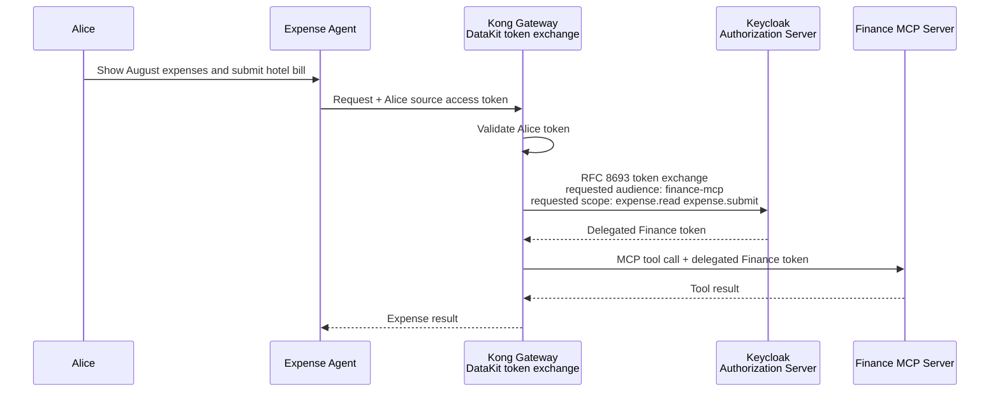

# Expense Agent: on-behalf-of token exchange

This demo shows how an AI agent can act for an employee without passing the employee's broad, original access token directly to a downstream Finance MCP server.

Alice asks the Expense Agent:

> Show me my expenses from August and submit this ₹12,000 hotel bill.

Kong DataKit exchanges Alice's and the agent's credentials for a Finance-specific delegated token, then sends only that narrower token to the Finance MCP server through AI Gateway 2.0.

## What the audience should understand

There are two identities in the story:

| Identity | Role |
| --- | --- |
| Alice | The human on whose behalf the request is made. |
| `expense-agent-01` | The workload that carries out the task for Alice. |

The Finance MCP server should be able to audit both identities, while receiving only the permissions needed for this task. It must not receive Alice's original token for the AI Gateway.

## The demo flow



Behind the scenes, the steps are:

1. Alice signs in with Keycloak using Authorization Code with PKCE. The agent receives an access token intended for the AI Gateway.
2. The Expense Agent sends Alice's access token to Kong with the MCP request.
3. Kong reads the source token and the actor token supplied by the registered Expense Agent workload.
4. A DataKit access-phase flow constructs the RFC 8693 request with `subject_token`, `actor_token`, target audience, and requested scopes, then calls Keycloak's token endpoint.
5. Keycloak validates both inputs, evaluates its delegation and authorization policy, then issues a short-lived Finance token.
6. DataKit replaces the upstream `Authorization` header with the delegated token and removes the actor-token header before proxying to the AI Gateway 2.0 MCP listener.
7. Finance MCP authorizes the requested tool from the delegated token's scopes and records the human and agent context for audit.

## Tokens shown in the demo

### 1. Alice's source token

This token is presented to Kong. It is for the AI Gateway trust boundary, not for Finance MCP.

```json
{
  "sub": "alice@example.com",
  "preferred_username": "alice@example.com",
  "name": "Alice",
  "aud": "enterprise-ai-gateway",
  "scope": "expense.read expense.submit expense.approve expense.admin"
}
```

The example deliberately gives Alice broad finance permissions. This makes the security value of exchange visible: the agent does not automatically inherit all of Alice's privileges.

### 2. Delegated Finance token

Keycloak returns a token appropriate for the downstream Finance MCP server.

```json
{
  "sub": "alice@example.com",
  "preferred_username": "alice@example.com",
  "name": "Alice",
  "aud": "finance-mcp",
  "scope": "expense.read expense.submit",
  "act": {
    "sub": "expense-agent-01"
  }
}
```

`sub` identifies Alice, the person on whose behalf the action occurs. The `act` claim identifies the acting agent. `aud` prevents the token being reused at an unrelated resource, and the downscoped `scope` prevents the agent from approving expenses even if Alice can do so herself.

The precise claims are an authorization-server design choice. The important demo rule is that the result token is narrower, short-lived, and targeted at `finance-mcp`.

## Tool authorization

The Finance MCP server maps each tool to a required delegated scope.

| MCP tool | Required scope | Result with the delegated token |
| --- | --- | --- |
| `get_august_expenses` | `expense.read` | Allowed |
| `submit_hotel_expense` | `expense.submit` | Allowed |
| `approve_expense` | `expense.approve` | Denied |

For the denied action, Kong returns an authorization response before the downstream tool runs. The Finance MCP backend never receives an approval request that lacks `expense.approve`.

## Suggested UI walkthrough

Use the scene as a guided security narrative rather than a generic end-to-end orchestration flow.

1. **Alice login**: show a Keycloak login screen, then publish the raw source token and its decoded claims side by side.
2. **Agent request**: show Alice's natural-language request and identify `expense-agent-01` as the acting workload.
3. **Kong validation**: highlight that Kong accepts the source token only at the AI Gateway boundary.
4. **Token exchange**: show the exchange inputs: source token, target audience `finance-mcp`, and requested scopes `expense.read expense.submit`.
5. **Delegated token**: show the raw result token and decoded claims beside it. Call out `sub`, `act`, `aud`, and the narrowed `scope`.
6. **Tool execution**: run the two allowed tools, then select `approve_expense` to demonstrate a denied call.
7. **Audit view**: show an event such as: `Alice, via expense-agent-01, submitted expense EXP-12345`.

The central line to narrate is:

> Finance receives a token for Alice, acting through the Expense Agent, with only the scopes and audience needed for this Finance task.

## DataKit implementation boundary

The AI Gateway 2.0 MCP-server entity does not provide a DataKit attachment point. The demo therefore puts DataKit at the Kong request boundary in front of the MCP listener. DataKit performs the exchange and writes the delegated bearer token to the upstream request. AI Gateway 2.0 then validates that delegated token and applies its MCP tool ACLs.

RFC 8693 also defines a two-token delegation form:

```text
subject_token = Alice's token
actor_token   = expense-agent-01's token
```

The resulting token can then contain an `act` claim for the agent. The DataKit flow is deliberately explicit: it sends both inputs to the authorization server, rather than assuming a basic OIDC exchange automatically forwards an arbitrary, separate agent token.

Keycloak remains the authority for whether `expense-agent-01` may act for Alice and for which resulting scopes may be minted. Kong does not manufacture the `act` claim or broaden permissions.

## Why exchange matters

Token exchange provides three security properties that are easy to demonstrate:

- **Identity continuity**: Finance can see Alice as the subject and the Expense Agent as the actor.
- **Least privilege**: the result contains only `expense.read` and `expense.submit`, never Alice's broader approval or administrative scopes.
- **Correct trust boundary**: the Finance MCP server accepts only a credential with `aud: finance-mcp`, instead of accepting a token originally minted for the AI Gateway.

## References

- [RFC 8693: OAuth 2.0 Token Exchange](https://www.rfc-editor.org/rfc/rfc8693)
- [Kong DataKit plugin](https://developer.konghq.com/plugins/datakit/)
- [Kong AI MCP OAuth2 plugin](https://developer.konghq.com/plugins/ai-mcp-oauth2/)
